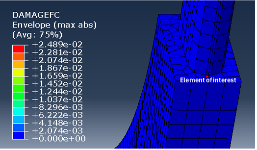

# cfrp-hockey-blade-FEA

> FE analysis of a CFRP ice hockey blade under slap shot, pass impact,  
> and fatigue loading — Hashin criteria + BK cohesive damage in Abaqus/Standard.

## Overview

Group project for *BK90C2701 Modelling of Metallic and Composite Materials*,  
LUT University, 2025. Simulates ply-level damage initiation and progression  
in a unidirectional T700/epoxy carbon-fibre blade under realistic game loading.

## Loading Cases

| Case | Puck velocity | Duration |
|---|---|---|
| Slap shot | 0.5 m/s | 8 ms |
| Pass impact | 0.5 m/s | 8 ms |
| Fatigue | 0.35 m/s × 10 cycles | 20 ms |

## Damage Models

- **Hashin criteria** — 4-mode damage initiation (fibre/matrix × tension/compression)
- **BK fracture energy** — mixed-mode delamination evolution (GIc = 91.6, GIIc = 90.0 N/mm)
- **SC8R continuum shell elements** — captures through-thickness stresses

## Key Results

- Blade–shaft interface identified as critical failure zone (element 4200)
- Slap shot: complete shear + matrix failure within 2 ms
- Fatigue: DAMAGEFC = 0.025 after 10 cycles → estimated full failure at **~400 cycles**
- Impact: gradual matrix degradation (DAMAGEMC ≈ 0.99), no full fibre failure

## Material Properties

T700/epoxy: E₁ = 135 GPa, σ_ft = 1500 MPa, σ_fc = 1200 MPa  
Vulcanized rubber puck: E = 7 MPa, ν = 0.48

## Authors

**Irfan Irfan**, Muhammad Uzair 
Supervisor: Prof. Hemantha Yeddu, LUT University

Portfolio: [irfan.research](https://irfa463.github.io)
